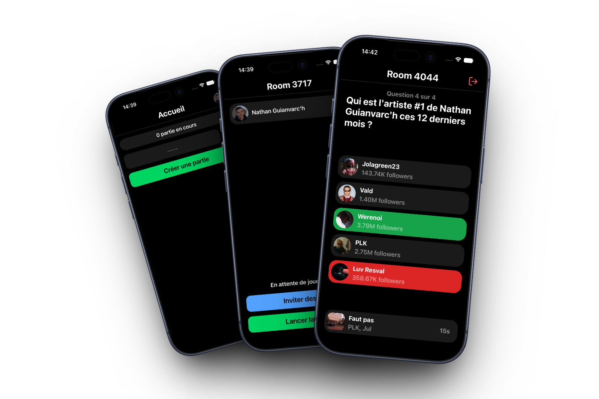

<h1 align="center">
  Questify
	
</h1>

**Un blindtest multijoueur où les questions portent sur les goûts musicaux de tes amis.**

Questify est une application mobile de quiz musical en temps réel. Chaque joueur se connecte avec son compte Spotify, et l'application génère les questions à partir des **vraies statistiques d'écoute des participants** : « Qui est l'artiste #1 de Nathan ces 12 derniers mois ? », « Quelle est la musique #1 de Léa ces 4 dernières semaines ? », le tout accompagné d'un extrait audio de 30 secondes.

---

## ⚠️ Statut : projet arrêté

**Ce projet n'est plus développé et ne peut pas être publié.** La cause n'est pas technique : l'application fonctionne. Le blocage est contractuel, dû au verrouillage progressif de l'API Spotify entre 2024 et 2026.

Le détail complet est dans la section [Pourquoi le projet est arrêté](#pourquoi-le-projet-est-arrêté). En résumé : les quiz musicaux sont explicitement interdits par la Developer Policy de Spotify, et l'accès API nécessaire à une publication publique est désormais réservé aux entreprises d'au moins 250 000 utilisateurs actifs mensuels.

Le code reste en ligne comme référence technique et comme base réutilisable pour une reprise sur une autre source de données musicales.

---

## Fonctionnalités

### Authentification Spotify

- Connexion OAuth via `expo-auth-session`, redirection par deep link (`questify://login`)
- Échange du code d'autorisation côté serveur, pour que le client secret ne soit jamais embarqué dans l'app
- Tokens stockés de façon chiffrée avec `expo-secure-store`
- Rafraîchissement automatique et transparent du token avant chaque requête
- Scopes demandés : `user-read-email`, `user-top-read`
- Écran de profil (avatar, pseudo, email) et déconnexion

### Salons multijoueur temps réel

- Création d'une partie générant un **code à 4 chiffres**
- Rejoindre une partie par saisie du code
- Jusqu'à **5 joueurs** par salon
- Compteur global des **parties en cours**, diffusé en direct à tous les clients connectés
- Hôte identifié par une couronne dans la liste des joueurs
- Transfert automatique du rôle d'hôte si celui-ci quitte la partie
- Expulsion d'un joueur par l'hôte
- Fermeture automatique du salon quand le dernier joueur part
- Sortie de partie avec confirmation, et gestion des déconnexions réseau

### Invitation et partage

- Génération d'un lien de partage passant par le serveur (`/share/:roomCode`)
- Page de redirection avec **métadonnées Open Graph** (titre, description, image), pour un aperçu propre quand le lien est envoyé sur WhatsApp, iMessage ou Discord
- Redirection automatique vers l'application via deep link
- Partage déclenché depuis la feuille de partage native iOS/Android

### Génération des questions

- **6 catégories** de questions, construites à partir des statistiques Spotify de chaque joueur :
  - Top artistes sur 4 semaines / 6 mois / 12 mois
  - Top titres sur 4 semaines / 6 mois / 12 mois
- Ordre des catégories et des propositions **mélangé à chaque partie**
- 5 propositions par question, issues du vrai top 5 du joueur (les mauvaises réponses sont donc crédibles)
- Association d'un **extrait audio de 30 s** à chaque question
- Le questionnaire est intégralement pré-généré au lancement de la partie, pour éviter toute latence en cours de jeu

### Boucle de jeu

- Lecture automatique de l'extrait audio à l'affichage de chaque question (`expo-audio`)
- Affichage de la pochette, du titre et des artistes du morceau joué
- **Compte à rebours** par question (15 s par défaut)
- Réponses colorées selon leur état : en attente, sélectionnée, correcte, incorrecte
- **Retour haptique** contextuel (`expo-haptics`) : sélection, succès, erreur
- **Animations** (`react-native-reanimated`) : secousse horizontale sur mauvaise réponse, halo vert pulsé sur bonne réponse
- Verrouillage des propositions après avoir répondu
- Progression automatique vers la question suivante quand tous les joueurs ont répondu
- Scoring : 1 point par bonne réponse, calculé côté serveur (le client ne connaît jamais la réponse attendue à l'avance)
- Écran de résultats final avec classement, avatars et scores

---

## Stack technique

| Partie      | Technologies                                                                                                                                                      |
| ----------- | ----------------------------------------------------------------------------------------------------------------------------------------------------------------- |
| **Mobile**  | Expo 54, React Native 0.81, Expo Router (routage par fichiers), Zustand, NativeWind 4, react-native-reanimated 4, expo-audio, expo-secure-store, socket.io-client |
| **Serveur** | Bun, Express 5, Socket.IO, proxy Spotify                                                                                                                          |
| **Partagé** | TypeScript : types de domaine et contrats d'événements Socket.IO typés de bout en bout                                                                            |

Le point le plus intéressant de l'architecture est le package `shared` : les interfaces `ServerToClientEvents` et `ClientToServerEvents` y sont déclarées une seule fois, puis consommées par le serveur **et** par le client. Toute divergence de contrat entre les deux côtés devient une erreur de compilation plutôt qu'un bug silencieux à l'exécution.

### Structure

```
questify/
├── mobile/                 # Application Expo / React Native
│   ├── app/                # Écrans (routage par fichiers)
│   │   ├── _layout.tsx     # Layout racine, garde d'authentification
│   │   ├── login.tsx       # Connexion Spotify
│   │   ├── index.tsx       # Accueil : créer / rejoindre une partie
│   │   ├── room.tsx        # Salon (différent selon l'état de la partie)
│   │   └── profile.tsx     # Profil et déconnexion
│   ├── screens/            # Les trois phases de jeu
│   │   ├── WaitingScreen.tsx
│   │   ├── GameInProgress.tsx
│   │   └── GameFinished.tsx
│   ├── components/         # Button, Input, Answer, NavBar…
│   ├── hooks/              # Stores Zustand + instance socket
│   └── services/           # Client de l'API Spotify
│
├── server/                 # API et serveur temps réel
│   └── src/
│       ├── index.ts        # Express, page de partage, point d'entrée
│       ├── socket.ts       # Initialisation Socket.IO
│       ├── sockets/        # Gestionnaires d'événements de salon et de jeu
│       ├── state/          # État en mémoire (salons, scores, réponses)
│       ├── routes/         # Proxy Spotify
│       └── utils/          # Génération des questions, appels Spotify
│
└── shared/                 # Types et contrats partagés
    └── src/types/          # Room, Player, GameQuestion, événements socket
```

### Flux de données

Le mobile ne parle **jamais** directement à l'API Spotify pour les opérations sensibles. Toutes les requêtes passent par le serveur, seul détenteur du client secret :

```
Mobile  ──REST──▶  Serveur  ──▶  API Spotify
   │                  │
   └────Socket.IO─────┘          (temps réel : salons, questions, scores)
```

L'état des parties est conservé en mémoire côté serveur

---

## Installation

### Prérequis

- [Bun](https://bun.sh)
- Xcode (iOS) et/ou Android Studio
- Une application enregistrée sur le [Spotify Developer Dashboard](https://developer.spotify.com/dashboard) avec `questify://login` en URI de redirection

> Voir la section [Pourquoi le projet est arrêté](#pourquoi-le-projet-est-arrêté) avant de vous lancer : plusieurs endpoints utilisés ici ont été supprimés par Spotify, et le mode développement est désormais limité à 5 utilisateurs.

### Variables d'environnement

`server/.env`

```
SPOTIFY_CLIENT_ID=...
SPOTIFY_CLIENT_SECRET=...
```

`mobile/.env`

```
EXPO_PUBLIC_SPOTIFY_CLIENT_ID=...
EXPO_PUBLIC_SERVER_URL=http://localhost:3000
```

### Lancement

```bash
bun install
bun run dev          # mobile + serveur en parallèle
```

Ou séparément :

```bash
bun run server       # API sur le port 3000
bun run mobile       # bundler Expo
```

### Build natif iOS

L'application utilise des modules natifs (audio, stockage sécurisé) : Expo Go ne suffit pas, il faut un build de développement.

```bash
cd mobile/ios && pod install
cd .. && npx expo run:ios
```

---

## Pourquoi le projet est arrêté

Questify dépend de deux choses fournies par Spotify : les **statistiques d'écoute** des joueurs et des **extraits audio de 30 secondes**. Entre novembre 2024 et février 2026, Spotify a fermé l'accès aux deux, et a par ailleurs confirmé que ce type d'application n'est pas autorisé.

### 1. Les quiz musicaux sont explicitement interdits

La Developer Policy de Spotify, dans sa section « Some Prohibited Applications », interdit :

> « Incorporating Spotify into any gaming or quiz functionality. For example, a "name that tune" quiz would not be allowed. »

Questify est littéralement l'exemple donné par la policy. Ce n'est pas une zone d'interprétation. Les réponses officielles sur le forum développeurs précisent que l'interdiction couvre **toute donnée Spotify utilisée dans un jeu ou un quiz, quelle que soit l'implémentation**, donc y compris une version sans audio, basée uniquement sur les métadonnées. Spotify indique également ne pas accorder d'augmentation de quota aux applications non conformes, même lorsque le développement est déjà terminé, et qu'aucune dérogation n'est possible.

### 2. L'accès étendu est fermé aux développeurs individuels

Une application Spotify démarre en _Development Mode_, limitée à une poignée de testeurs ajoutés manuellement. Publier au grand public exige l'_Extended Quota Mode_.

Depuis mai 2025, ce mode est réservé aux applications présentant un usage « établi, scalable et à impact ». Dans les faits : **entreprise enregistrée, service déjà lancé, et minimum ~250 000 utilisateurs actifs mensuels**. Les développeurs individuels ne peuvent plus déposer de demande. Un projet indépendant ne peut donc structurellement pas sortir du mode développement.

### 3. Les endpoints nécessaires ont été supprimés

- **Novembre 2024** : suppression du champ `preview_url` (les extraits de 30 s) pour toute nouvelle application, en même temps que les endpoints Recommendations, Audio Features, Audio Analysis et Related Artists. C'est ce qui a privé le projet de sa source audio.
- **Février 2026** : nouveau tour de vis sur le Development Mode : **5 utilisateurs maximum**, **un seul Client ID par développeur**, et **abonnement Premium obligatoire** pour le propriétaire de l'application. Plusieurs endpoints utilisés par ce projet disparaissent, dont **artist top-tracks** (qui alimentait les extraits audio des questions « artiste ») et les récupérations groupées `GET /tracks`. Migration imposée avant le 9 mars 2026.

### Conclusion

Le problème n'est pas la faisabilité technique : le jeu tourne, le temps réel fonctionne, les questions se génèrent. Le problème est qu'il n'existe aucun chemin **légal** entre ce prototype et une application distribuée, tant que Spotify est la source de données.

---

## Limitations connues

Le projet ayant été arrêté avant finalisation, plusieurs chantiers restent ouverts :

- Le minuteur de fin de question n'est pas appliqué côté serveur : une partie peut se figer si un joueur ne répond jamais
- Les questions ne portent que sur l'hôte du salon ; les statistiques des autres joueurs sont collectées mais inexploitées
- Le type de question « deviner à quel joueur appartient ce goût » est modélisé mais jamais généré
- Le bouton « Rejouer » de l'écran de résultats n'est pas implémenté
- Le lien d'invitation ouvre l'application mais ne fait pas rejoindre automatiquement le salon (route de deep link manquante)
- Pas de reconnexion possible en cours de partie : l'identité d'un joueur est liée à son identifiant de socket, qui change à chaque connexion
- Aucun test automatisé, ni intégration continue

---

## Licence

Projet personnel, publié à titre de démonstration technique.
